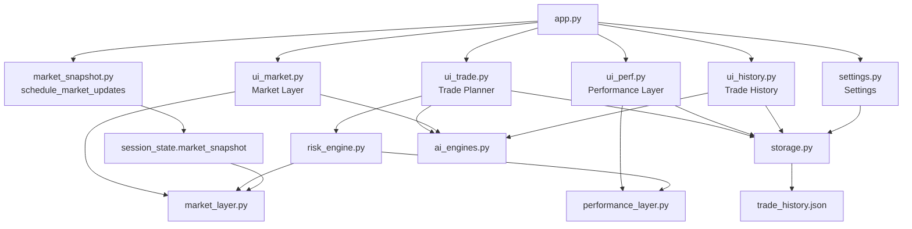
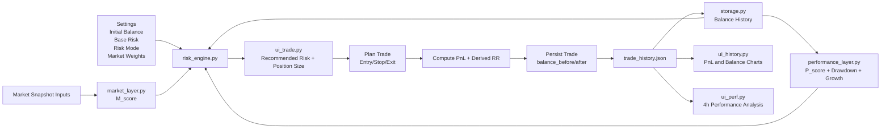

# TradePlanner 3.0 - Full Application Documentation

## 1. Overview
TradePlanner 3.0 is a Streamlit-based trading decision and journaling application with five primary surfaces:
- Trade Planner
- Market Layer
- Performance Layer
- Trade History
- Settings

The app combines market context (M score), trading performance context (P score), and account balance state to produce a dynamic recommended risk percent and balance-aware position sizing.

Core goals:
- Improve risk discipline
- Keep trader context visible
- Track account equity through time
- Maintain explainability for score and risk decisions

## 2. High-Level Architecture
Entry point:
- `app.py`

Primary modules:
- `ui_trade.py`: trade planning workflow, top action panel, symbol handling, risk-sized position calculation
- `ui_market.py`: recursive market explainability dashboard
- `ui_perf.py`: recursive performance explainability dashboard with 4h aggregation over 30 days
- `ui_history.py`: trade table, PnL chart, and balance evolution chart
- `settings.py`: system controls (risk mode, base risk, market weights, initial balance)
- `risk_engine.py`: computes recommended risk from P, M, balance ratio, and drawdown
- `performance_layer.py`: computes P score plus balance-aware metrics (return, growth, drawdown)
- `market_layer.py`: computes M score from 4 market pillars
- `market_snapshot.py`: refreshes snapshot data from public sources and computes market features
- `storage.py`: JSON persistence and canonical balance history utilities
- `ai_engines.py`: explanation and journaling text generation with safe fallback behavior

Storage:
- `trade_history.json`

## 3. Navigation and Page Routing
Defined in `app.py`:
- Trade Planner -> `render_trade_planning`
- Market Layer -> `render_market_dashboard`
- Performance Layer -> `render_performance_dashboard`
- Trade History -> `render_history`
- Settings -> `render_settings`

Startup behavior:
- `schedule_market_updates()` runs on app launch to keep market snapshot fresh.

## 4. Data Model (Trade Record)
Trade records are stored as JSON objects in `trade_history.json`.

Important fields used across the app:
- Trade identity and execution:
  - `date`, `time`, `symbol`, `exchange`, `direction`
  - `entry`, `exit`, `units`, `stop_loss_price`, `stop_loss_distance`
- Risk and scoring context:
  - `risk_pct`, `actual_risk_pct`, `recommended_risk_pct`
  - `P_score`, `M_score`, `market_risk_mode`, `risk_breakdown`
- PnL:
  - `trading_fee`, `pnl`, `result`
- Balance tracking (new canonical fields):
  - `initial_balance`, `balance_before`, `balance_after`, `cumulative_pnl`
- Derived execution quality:
  - `rr` (derived at plan time from entry/stop/exit)

## 5. Balance System (Single Source of Truth)
Balance logic is centralized in `storage.py`:
- `get_initial_balance(state)`
- `compute_balance_history(trades, initial_balance)`
- `get_current_balance(trades, initial_balance)`
- `get_peak_balance(trades, initial_balance)`

Behavior:
1. Initial balance is configured in Settings (`initial_balance`, default 10000).
2. Current balance is derived from stored trades and persisted fields.
3. Planner uses current balance to size risk amount and position size.
4. On save, each trade persists `balance_before`, `balance_after`, and `cumulative_pnl`.
5. History and Performance recompute or validate equity curve from persisted values.

## 6. Trade Planner Flow (`ui_trade.py`)
Top panel (decision-first hierarchy):
- Balance
- Recommended Risk percent (hero metric)
- Performance score
- Market score
- Net PnL
- Context explanation + balance status messaging

Configuration flow:
1. Select symbol
2. Auto-fetch live price from Binance ticker endpoint
3. Apply symbol defaults (SL buffer, default RR seed, fee, exchange)
4. Update dependent fields:
   - Entry (locked to current price)
   - Stop loss (derived from entry and SL distance)
   - Exit (editable by user)

Plan behavior:
- Exit is configurable.
- RR input is removed from the Plan Trade section.
- RR is calculated once user presses Plan:
  - `rr = abs(exit - entry) / abs(entry - stop)`

Risk sizing behavior:
- `risk_amount = current_balance * (actual_risk_pct / 100)`
- `units = risk_amount / sl_distance`

Outcome feedback:
- Winning trade: green badge + green PnL
- Losing trade: red badge + red PnL

## 7. Risk Engine (`risk_engine.py`)
Inputs:
- Performance score `P` from `compute_performance_layer`
- Market score `M` from `compute_market_layer`
- Base risk percent and risk mode from Settings
- Balance context from equity history:
  - balance ratio = current_balance / initial_balance
  - current drawdown percent

Core risk components:
- Combined signal:
  - `combined = 0.60*P + 0.40*M`
- Market gate:
  - `0.80` when `M < 40`, else `1.00`
- Upside boost:
  - `1.10` when `P > 70 and M > 60`, else `1.00`
- Engine mode multiplier:
  - Aggressive `1.25`, Moderate `1.00`, Conservative `0.75`
- Balance growth factor:
  - bounded factor from balance ratio, approximately `[0.85, 1.15]`
- Drawdown protection:
  - bounded factor from current drawdown, floor at `0.65`

Final risk percent:
- Clamped to `[0.10, 5.00]`

The engine returns:
- `acceptable_risk_pct`
- `P_score`, `M_score`
- `risk_breakdown` with all component factors and formula string

## 8. Performance Layer (`performance_layer.py` and `ui_perf.py`)
### 8.1 Canonical score engine
`compute_performance_layer(df, initial_balance)` computes:
- Winrate and winrate score
- Loss streak and streak score
- PnL drift and drift score
- Trade quality score (RR and risk violations)
- Expectancy score
- Balance-aware metrics:
  - `equity_return_pct`
  - `recent_return_pct`
  - `max_drawdown_pct`
  - `current_drawdown_pct`
  - `growth_score`
  - `drawdown_score`
  - `balance_efficiency_score`

Current P score weighting includes both trade and equity quality terms.

### 8.2 Dashboard layer
`ui_perf.py`:
- Builds 4h buckets over last 30 days
- Computes rolling metrics and anomaly points
- Renders recursive explainability tree
- Root score references canonical `P_score` from `performance_layer.py`

## 9. Market Layer (`market_layer.py` and `ui_market.py`)
Market score is a weighted sum of four pillars:
- Price structure and volatility
- Macro and cross-asset
- Positioning and flow
- Sentiment and narrative

Notable details:
- Includes regime sub-score from EMA slope, ADX, structure, compression
- Market config weights are normalized in risk engine and reused in UI
- Dashboard provides recursive explainability and component breakdown

## 10. Trade History (`ui_history.py`)
Features:
- Styled trade table with profit/loss color semantics
- Columns include trade number, PnL, cumulative PnL, and balance
- PnL-by-trade chart with red/green outcome points
- Balance evolution chart:
  - Title: Balance vs Trade Number
  - X: trade index
  - Y: balance
  - Optional overlay: PnL bars + balance line

## 11. Settings (`settings.py`)
Configurable inputs:
- Initial Balance
- Current Balance (derived display)
- Risk engine mode (Aggressive/Moderate/Conservative)
- Base Risk percent
- Performance layer tuning inputs
- Market block weights
- Maintenance reset

Reset behavior:
- Clears trade history
- Resets balance state to initial balance
- Clears market snapshot

## 12. External Data and Dependencies
Primary runtime dependencies:
- `streamlit`
- `pandas`
- `numpy`
- `altair`
- `requests`

Market and symbol data sources:
- Binance ticker and kline endpoints
- Alternative.me Fear and Greed
- Optional FRED and AlphaVantage hooks in snapshot builder

AI text generation:
- `ai_engines.py` attempts OpenAI calls and uses deterministic fallback text on failure.

## 13. Run Instructions
From repository root:

```bash
pip install streamlit pandas numpy altair requests
streamlit run app.py
```

## 14. Validation and Guardrails
Recommended checks after changes:
- Compile check:
  - `python -m py_compile app.py ui_trade.py ui_history.py ui_market.py ui_perf.py risk_engine.py performance_layer.py settings.py storage.py`
- Runtime sanity:
  - symbol switch updates price and dependent fields
  - planning a trade updates balance-related fields
  - history shows balance evolution correctly
  - risk percent changes as balance and drawdown change

## 15. Known Design Notes
- Some helper fields are reconstructed for older trades that do not contain newly introduced balance fields.
- `logic.py` remains a helper utility and is not currently the primary execution path for the Streamlit planner.
- `ui_docs.py` exists in repo but is not currently wired into page navigation.

## 16. File Interaction Flow Diagram
This section explains how files talk to each other, in execution order.

### 16.1 Page and module interaction


### 16.2 Non-technical explanation
1. `app.py` is the switchboard. It decides which screen you see.
2. `market_snapshot.py` refreshes market inputs in the background.
3. `ui_trade.py` asks `risk_engine.py` for recommended risk.
4. `risk_engine.py` combines:
   - performance quality from `performance_layer.py`
   - market quality from `market_layer.py`
   - account balance and drawdown context from `storage.py`
5. `storage.py` reads and writes `trade_history.json`, which is the app's memory.
6. `ui_history.py` and `ui_perf.py` use the saved trade history to show progress and diagnostics.

## 17. Data Flow Diagram (Computation Pipeline)
This shows the end-to-end flow from settings and market data to trade result and updated balance.



### 17.1 Non-technical flow summary
1. You set your risk preferences and starting account in Settings.
2. The app reads recent trade outcomes and market conditions.
3. It computes two health signals:
   - `P_score`: how well your strategy has been performing
   - `M_score`: how favorable market conditions are
4. It also measures account stress (drawdown) and account growth.
5. The risk engine combines these into a recommended risk percentage.
6. In Trade Planner, position size is calculated from your current balance.
7. After planning/saving a trade, new balance values are stored.
8. History and Performance screens immediately reflect the updated account path.

## 18. Data Dictionary For Non-Technical Users
Each data point below includes meaning, purpose, and simple computation logic.

### 18.1 Account and trade sizing data
| Data Point | What It Means | Why It Exists | How It Is Computed |
|---|---|---|---|
| `initial_balance` | Starting account value | Baseline for growth and drawdown tracking | Set in Settings by user (default 10000) |
| `current_balance` | Latest account value | Determines how large next position can be | Initial balance plus all historical PnL |
| `balance_before` | Account value before a trade | Shows trade was sized from real equity | Previous trade's `balance_after` (or initial balance) |
| `balance_after` | Account value after a trade | Tracks account progression | `balance_before + pnl` |
| `cumulative_pnl` | Total profit/loss since start | Shows net performance in currency terms | `balance_after - initial_balance` |
| `risk_pct` | Risk percent used for this trade | Controls position size | User input in planner (percent) |
| `risk_amount` | Currency amount you are willing to lose | Converts percent risk into money | `current_balance * risk_pct / 100` |
| `stop_loss_distance` | Price distance from entry to stop | Defines per-unit risk | `abs(entry - stop_loss_price)` |
| `units` | Position size | Makes risk consistent across balances | `risk_amount / stop_loss_distance` |

### 18.2 Trade outcome data
| Data Point | What It Means | Why It Exists | How It Is Computed |
|---|---|---|---|
| `entry` | Planned entry price | Anchor for all trade math | Pulled from live symbol price |
| `exit` | Planned target/exit price | Defines expected reward | User configurable in planner |
| `trading_fee` | Estimated fee cost | Prevents overestimating profitability | `units * entry * fee_rate` |
| `pnl` | Trade result in currency | Updates account equity | Long: `(exit-entry)*units - fee`; Short: `(entry-exit)*units - fee` |
| `result` | Win or Loss label | Fast visual interpretation | `Win` if `pnl > 0`, else `Loss` |
| `rr` | Reward to risk ratio | Quality check for setup payoff | `abs(exit-entry) / abs(entry-stop_loss)` |

### 18.3 Market and performance context
| Data Point | What It Means | Why It Exists | How It Is Computed |
|---|---|---|---|
| `P_score` | Strategy performance strength (0-100) | Tells if your own execution is healthy | Weighted blend of winrate, streak, drift, quality, expectancy, growth, drawdown |
| `M_score` | Market quality score (0-100) | Tells if current market is supportive | Weighted blend of price, macro, flow, sentiment pillars |
| `equity_return_pct` | Account percent growth from start | Shows account efficiency | `(current_balance - initial_balance) / initial_balance * 100` |
| `max_drawdown_pct` | Worst drop from prior peak | Measures risk stress | Peak-to-trough decline on equity curve |
| `current_drawdown_pct` | Current drop from peak | Risk brake input | Current equity versus historical peak |

### 18.4 Risk recommendation outputs
| Data Point | What It Means | Why It Exists | How It Is Computed |
|---|---|---|---|
| `acceptable_risk_pct` | Recommended risk per trade | Main decision signal for position sizing | Risk engine formula combining P, M, mode, balance, drawdown |
| `market_gate` | Downside guard when market weak | Prevents overexposure in poor conditions | `0.80` if `M_score < 40`, else `1.00` |
| `performance_boost` | Upside expansion in strong conditions | Allows controlled scaling | `1.10` if `P_score > 70` and `M_score > 60`, else `1.00` |
| `engine_multiplier` | User risk profile factor | Lets user pick conservative/moderate/aggressive profile | Conservative `0.75`, Moderate `1.00`, Aggressive `1.25` |
| `balance_growth_factor` | Equity growth sensitivity | Scales risk gently up/down with account growth | Bounded factor from `current_balance / initial_balance` |
| `drawdown_protection` | Drawdown safety brake | Cuts risk while recovering losses | Bounded factor that decreases as drawdown rises |

## 19. Plain-English Story Of One Trade
1. You choose a symbol and the app fetches live price.
2. You set stop and exit; the app computes expected payoff (`rr`) and position size from your balance.
3. The app asks the risk engine how much risk is sensible right now.
4. That recommendation reflects strategy health (`P_score`), market health (`M_score`), and account stress (drawdown).
5. Once saved, the trade updates your balance history.
6. New balance feeds back into future risk calculations, creating a closed-loop capital discipline system.
